# TP3 DPBO 2025/2026

## Data Diri

| Keterangan  | Isi                                       |
| ----------- | ----------------------------------------- |
| Nama        | Fakhri Fauzan                             |
| NIM         | 2501536                                   |
| Kelas       | C2                                        |
| Mata Kuliah | Desain dan Pemrograman Berorientasi Objek |

---

# Janji

Saya Fakhri Fauzan dengan NIM 2501536 mengerjakan Tugas Praktikum 3 dalam mata kuliah Desain dan Pemrograman Berorientasi Objek untuk keberkahan-Nya maka saya tidak melakukan kecurangan seperti yang telah dispesifikasikan. Aamiin.

---

# Deskripsi Program

Program merupakan sistem sederhana yang menggambarkan data karakter dalam sebuah game.

Program menggunakan lima class utama, yaitu:

- `Karakter`
- `Player`
- `NPC`
- `Inventory`
- `Item`

Program menerapkan beberapa konsep pemrograman berorientasi objek yang dipelajari pada TP3, yaitu:

- **Inheritance**
- **Hierarchical Inheritance**
- **Composition**
- **Array/List of Objects**
- **Method Overriding**
- **Encapsulation**

Hubungan inheritance yang digunakan adalah:

```text
             Karakter
             /      \
            /        \
        Player       NPC
```

`Player` dan `NPC` merupakan turunan dari `Karakter`.

Selain inheritance, `Player` memiliki `Inventory`, sedangkan `Inventory` menyimpan kumpulan `Item`. Hubungan tersebut digunakan untuk menerapkan konsep **composition**.

```text
Player
   │
   ◆
   │
Inventory
   │
   ◆
   │
Item
```

Program dibuat menggunakan tiga bahasa pemrograman:

1. C++
2. Python
3. Java

Versi C++, Python, dan Java dibuat dalam bentuk **CLI (Command Line Interface)**.

Program memiliki beberapa object awal yang dibuat sebelum user memasukkan data tambahan. User kemudian dapat menambahkan `Player` atau `NPC` melalui menu program.

---

# Desain Program

## Relasi Antar Class

Program menggunakan **Hierarchical Inheritance**, yaitu satu class parent memiliki lebih dari satu class turunan.

Hubungan inheritance pada program adalah:

```text
             Karakter
             /      \
            ↓        ↓
         Player      NPC
```

`Karakter` menjadi class dasar yang menyimpan atribut umum yang dapat dimiliki oleh karakter dalam game.

`Player` dan `NPC` kemudian mewarisi atribut dan method dari `Karakter`.

Selain inheritance, terdapat hubungan composition:

```text
Player
   │
   ◆
   │
Inventory
   │
   ◆
   │
Item
```

`Player` memiliki sebuah `Inventory`, sedangkan `Inventory` memiliki kumpulan object `Item`.

Dengan demikian, desain program menggunakan dua jenis hubungan utama:

| Relasi                   | Class                 | Keterangan                                  |
| ------------------------ | --------------------- | ------------------------------------------- |
| Hierarchical Inheritance | `Karakter → Player`   | Player merupakan jenis karakter             |
| Hierarchical Inheritance | `Karakter → NPC`      | NPC merupakan jenis karakter                |
| Composition              | `Player ◆→ Inventory` | Inventory merupakan bagian dari Player      |
| Composition              | `Inventory ◆→ Item`   | Item disimpan sebagai bagian dari Inventory |

---

# Desain Diagram

Design diagram dibuat menggunakan draw.io dan merepresentasikan hubungan inheritance, composition, attribute, serta method dari seluruh class.

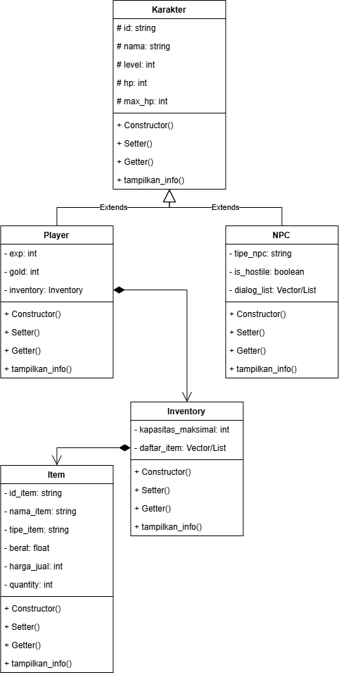

---

# Penjelasan Class

## 1. Karakter

`Karakter` merupakan **base class** yang menyimpan attribute dan method umum yang dapat dimiliki oleh karakter dalam game.

Class ini menjadi parent bagi `Player` dan `NPC`.

### Attribute

| Attribute | Tipe    | Keterangan                           |
| --------- | ------- | ------------------------------------ |
| `id`      | String  | Identitas unik karakter              |
| `nama`    | String  | Nama karakter                        |
| `level`   | Integer | Level karakter                       |
| `hp`      | Integer | Health point karakter saat ini       |
| `max_hp`  | Integer | Batas maksimum health point karakter |

Attribute pada class `Karakter` menggunakan access modifier `protected` agar dapat digunakan oleh class turunannya.

### Method

| Method                     | Keterangan                            |
| -------------------------- | ------------------------------------- |
| Constructor                | Menginisialisasi attribute `Karakter` |
| Setter dan Getter `id`     | Mengubah dan mengambil ID karakter    |
| Setter dan Getter `nama`   | Mengubah dan mengambil nama karakter  |
| Setter dan Getter `level`  | Mengubah dan mengambil level karakter |
| Setter dan Getter `hp`     | Mengubah dan mengambil HP karakter    |
| Setter dan Getter `max_hp` | Mengubah dan mengambil maksimum HP    |
| `tampilkan_info()`         | Menampilkan informasi dasar karakter  |

---

## 2. Player

`Player` merupakan class turunan dari `Karakter`.

Karena `Player` merupakan salah satu jenis karakter dalam game, maka `Player` mewarisi seluruh attribute dan method yang dimiliki oleh `Karakter`.

Selain itu, `Player` memiliki attribute khusus berupa experience, gold, dan inventory.

### Attribute

| Attribute   | Tipe        | Keterangan                                |
| ----------- | ----------- | ----------------------------------------- |
| `exp`       | Integer     | Experience point yang dimiliki Player     |
| `gold`      | Integer     | Jumlah mata uang yang dimiliki Player     |
| `inventory` | `Inventory` | Inventory yang menjadi bagian dari Player |

`inventory` digunakan untuk menerapkan hubungan **composition** antara `Player` dan `Inventory`.

### Method

| Method                   | Keterangan                                                            |
| ------------------------ | --------------------------------------------------------------------- |
| Constructor              | Menginisialisasi attribute `Player` dan bagian object dari `Karakter` |
| Setter dan Getter `exp`  | Mengubah dan mengambil experience point                               |
| Setter dan Getter `gold` | Mengubah dan mengambil jumlah gold                                    |
| `getInventory()`         | Mengambil object `Inventory` milik Player                             |
| `tampilkan_info()`       | Menampilkan informasi Player                                          |

Method `tampilkan_info()` pada `Player` meng-override method dengan nama yang sama pada `Karakter`.

---

## 3. NPC

`NPC` merupakan class turunan dari `Karakter`.

NPC digunakan untuk merepresentasikan karakter non-player dalam game, seperti penjual, pemberi quest, atau musuh.

### Attribute

| Attribute     | Tipe    | Keterangan                              |
| ------------- | ------- | --------------------------------------- |
| `tipe_npc`    | String  | Menunjukkan peran atau tipe NPC         |
| `is_hostile`  | Boolean | Menunjukkan apakah NPC bersifat agresif |
| `dialog_list` | List    | Menyimpan kumpulan dialog NPC           |

`dialog_list` menggunakan struktur data list karena satu NPC dapat memiliki lebih dari satu dialog.

### Method

| Method                          | Keterangan                                                         |
| ------------------------------- | ------------------------------------------------------------------ |
| Constructor                     | Menginisialisasi attribute `NPC` dan bagian object dari `Karakter` |
| Setter dan Getter `tipe_npc`    | Mengubah dan mengambil tipe NPC                                    |
| Setter dan Getter `is_hostile`  | Mengubah dan mengambil status agresivitas NPC                      |
| Setter dan Getter `dialog_list` | Mengubah dan mengambil daftar dialog                               |
| `tampilkan_info()`              | Menampilkan informasi NPC                                          |

Method `tampilkan_info()` pada `NPC` meng-override method dengan nama yang sama pada `Karakter`.

---

## 4. Inventory

`Inventory` digunakan untuk menyimpan kumpulan `Item` yang dimiliki oleh sebuah `Player`.

Class ini bukan turunan dari `Karakter`.

### Attribute

| Attribute            | Tipe    | Keterangan                               |
| -------------------- | ------- | ---------------------------------------- |
| `kapasitas_maksimal` | Integer | Jumlah maksimum item yang dapat disimpan |
| `daftar_item`        | List    | Kumpulan object `Item` yang tersimpan    |

### Method

| Method                                 | Keterangan                                              |
| -------------------------------------- | ------------------------------------------------------- |
| Constructor                            | Menginisialisasi kapasitas dan daftar item              |
| Setter dan Getter `kapasitas_maksimal` | Mengubah dan mengambil kapasitas Inventory              |
| `getDaftarItem()`                      | Mengambil daftar item                                   |
| `tambahItem()`                         | Menambahkan object `Item` ke Inventory                  |
| `tampilkan_info()`                     | Menampilkan informasi Inventory dan Item yang tersimpan |

---

## 5. Item

`Item` merupakan class yang digunakan untuk menyimpan informasi barang yang dapat dimiliki oleh Player melalui Inventory.

Class ini tidak memiliki hubungan inheritance dengan `Karakter`.

### Attribute

| Attribute    | Tipe    | Keterangan                  |
| ------------ | ------- | --------------------------- |
| `id_item`    | String  | Identitas unik Item         |
| `nama_item`  | String  | Nama Item                   |
| `tipe_item`  | String  | Kategori Item               |
| `berat`      | Float   | Berat Item dalam kilogram   |
| `harga_jual` | Integer | Harga jual Item             |
| `quantity`   | Integer | Jumlah Item dalam satu slot |

### Method

| Method                         | Keterangan                              |
| ------------------------------ | --------------------------------------- |
| Constructor                    | Menginisialisasi seluruh attribute Item |
| Setter dan Getter `id_item`    | Mengubah dan mengambil ID Item          |
| Setter dan Getter `nama_item`  | Mengubah dan mengambil nama Item        |
| Setter dan Getter `tipe_item`  | Mengubah dan mengambil tipe Item        |
| Setter dan Getter `berat`      | Mengubah dan mengambil berat Item       |
| Setter dan Getter `harga_jual` | Mengubah dan mengambil harga jual       |
| Setter dan Getter `quantity`   | Mengubah dan mengambil jumlah Item      |
| `tampilkan_info()`             | Menampilkan informasi Item              |

---

# Konsep Inheritance

## Hierarchical Inheritance

Program menggunakan **Hierarchical Inheritance**, yaitu satu class parent memiliki lebih dari satu class child.

Pada program ini:

```text
             Karakter
             /      \
            ↓        ↓
         Player      NPC
```

`Karakter` merupakan parent class, sedangkan `Player` dan `NPC` merupakan child class.

`Player` dan `NPC` sama-sama memiliki attribute dasar seperti:

- ID
- Nama
- Level
- HP
- Max HP

Attribute tersebut tidak perlu dibuat kembali pada setiap class karena dapat diwariskan dari `Karakter`.

### Alasan Pemilihan Hierarchical Inheritance

Hierarchical inheritance dipilih karena hubungan antara class sesuai dengan konsep karakter dalam game.

Baik `Player` maupun `NPC` merupakan karakter. Namun, keduanya memiliki karakteristik khusus yang berbeda.

```text
Karakter
   ├── Player
   │     ├── EXP
   │     ├── Gold
   │     └── Inventory
   │
   └── NPC
         ├── Tipe NPC
         ├── Hostile
         └── Dialog
```

Dengan desain tersebut, attribute yang bersifat umum ditempatkan pada `Karakter`, sedangkan attribute yang lebih spesifik ditempatkan pada class turunannya.

---

# Konsep Composition

Composition digunakan ketika sebuah object memiliki object lain sebagai bagian dari dirinya.

Pada program terdapat dua hubungan composition.

## 1. Player dan Inventory

`Player` memiliki sebuah `Inventory`.

Pada saat object `Player` dibuat, object `Inventory` juga dibuat sebagai bagian dari `Player`.

Contoh pada Java:

```java
private Inventory inventory;
```

Kemudian pada constructor:

```java
this.inventory = new Inventory();
```

Hubungan tersebut dapat digambarkan sebagai:

```text
Player
   │
   ◆
   │
Inventory
```

`Inventory` menjadi bagian dari `Player` karena setiap `Player` memiliki Inventory sendiri.

---

## 2. Inventory dan Item

`Inventory` menyimpan kumpulan object `Item`.

Pada Java digunakan:

```java
private List<Item> daftar_item;
```

Kemudian object `Item` ditambahkan ke dalam Inventory melalui method:

```java
tambahItem()
```

Hubungannya adalah:

```text
Inventory
   │
   ◆
   │
Item
```

Dengan demikian, `Inventory` berfungsi sebagai tempat penyimpanan kumpulan `Item`.

---

# Array / List of Objects

Program menggunakan struktur data untuk menyimpan beberapa object.

Pada Java, object `Player` dan `NPC` disimpan menggunakan `ArrayList`.

Contohnya:

```java
List<Player> daftarPlayer = new ArrayList<>();
List<NPC> daftarNpc = new ArrayList<>();
```

Object kemudian dimasukkan ke dalam list:

```java
daftarPlayer.add(player1);
daftarPlayer.add(player2);
```

Selain itu, `Inventory` juga menyimpan kumpulan object `Item`:

```java
private List<Item> daftar_item;
```

Dengan demikian, program menerapkan konsep **array/list of objects** karena struktur data digunakan untuk menyimpan beberapa object dari sebuah class.

Struktur data yang digunakan pada masing-masing bahasa adalah:

| Bahasa | Struktur Data |
| ------ | ------------- |
| C++    | `vector`      |
| Python | `list`        |
| Java   | `ArrayList`   |

---

# Method Overriding

Program menerapkan **method overriding** pada method `tampilkan_info()`.

Class `Karakter` memiliki:

```text
tampilkan_info()
```

Kemudian `Player` dan `NPC` memiliki method dengan nama yang sama untuk menampilkan informasi yang lebih spesifik.

Hubungannya:

```text
Karakter
   │
   └── tampilkan_info()

        ↓ override

Player
   └── tampilkan_info()

NPC
   └── tampilkan_info()
```

Pada `Player` dan `NPC`, informasi dasar dari `Karakter` tetap ditampilkan menggunakan method parent.

Pada Java, hal tersebut dilakukan dengan:

```java
super.tampilkan_info();
```

Setelah informasi dari parent ditampilkan, masing-masing class menambahkan informasi khusus miliknya.

Dengan demikian:

- `Karakter` menampilkan data dasar karakter.
- `Player` menampilkan data dasar karakter + EXP + Gold.
- `NPC` menampilkan data dasar karakter + tipe NPC + status hostile + dialog.

---

# Encapsulation dan Access Modifier

Konsep **encapsulation** digunakan dengan membatasi akses langsung terhadap attribute.

Pada `Karakter`, attribute menggunakan `protected`:

```java
protected String id;
protected String nama;
protected int level;
protected int hp;
protected int max_hp;
```

Penggunaan `protected` memungkinkan class turunan seperti `Player` dan `NPC` mengakses attribute tersebut secara langsung.

Namun, attribute tersebut tidak dapat diakses secara langsung dari luar class.

Sementara itu, attribute khusus pada `Player`, `NPC`, `Inventory`, dan `Item` menggunakan `private`.

Contohnya:

```java
private int exp;
private int gold;
private Inventory inventory;
```

Akses terhadap attribute dilakukan melalui getter dan setter.

Dengan demikian, akses terhadap data tetap dikontrol oleh method yang disediakan oleh class.

---

# Constructor dan Pewarisan

Constructor digunakan untuk menginisialisasi attribute ketika object dibuat.

Pada class turunan, constructor parent dipanggil terlebih dahulu untuk menginisialisasi bagian object yang berasal dari parent.

Contohnya pada Java `Player`:

```java
public Player(String id, String nama, int level, int hp, int max_hp, int exp, int gold) {
    super(id, nama, level, hp, max_hp);
    this.exp = exp;
    this.gold = gold;
    this.inventory = new Inventory();
}
```

`super(...)` digunakan untuk memanggil constructor `Karakter`.

Dengan demikian:

```text
Player
  │
  ├── bagian Karakter → super(...)
  │
  ├── exp
  ├── gold
  └── inventory
```

Hal yang sama diterapkan pada `NPC`.

---

# Object Awal

Program memiliki object awal yang dibuat sebelum user memasukkan data tambahan.

Object awal yang digunakan terdiri dari:

### Player

1. `P001` - Kiryu
2. `P002` - Akira

### NPC

1. `N001` - Merchant
2. `N002` - Goblin

Player awal juga memiliki Inventory dan Item.

Contohnya:

```text
Player Kiryu
└── Inventory
    ├── Pedang Besi
    └── Ramuan Penyembuh

Player Akira
└── Inventory
    └── Armor Besi
```

NPC awal memiliki beberapa dialog:

```text
Merchant
├── "Selamat datang di toko!"
└── "Apakah kamu ingin membeli sesuatu?"

Goblin
├── "Berani sekali kamu datang ke sini!"
└── "Aku akan mengalahkanmu!"
```

Object-object tersebut digunakan untuk menampilkan data awal sebelum user menambahkan data baru.

---

# Fitur Program

## 1. Menampilkan Data

Program dapat menampilkan seluruh data yang telah tersimpan.

Data yang ditampilkan meliputi:

- Player
- Inventory Player
- Item dalam Inventory
- NPC
- Dialog NPC

---

## 2. Tambah Player

User dapat menambahkan object `Player` baru melalui menu.

Data yang dimasukkan meliputi:

- ID
- Nama
- Level
- Max HP
- HP
- Experience
- Gold
- Kapasitas Inventory
- Jumlah Item
- Data setiap Item

Setiap Player baru secara otomatis memiliki object `Inventory`.

---

## 3. Tambah NPC

User dapat menambahkan object `NPC` baru.

Data yang dimasukkan meliputi:

- ID
- Nama
- Level
- Max HP
- HP
- Tipe NPC
- Status hostile
- Jumlah dialog
- Dialog NPC

---

## 4. Menu Program

Program menyediakan menu:

```text
============================================
                MENU GAME
============================================
1. Tambah Player
2. Tambah NPC
3. Tampilkan Semua Data
0. Keluar
============================================
```

Menu dijalankan berulang sampai user memilih menu `0`.

---

# Error Handling dan Validasi

Program memiliki validasi untuk mencegah data yang tidak sesuai.

## 1. ID Karakter Tidak Boleh Duplikat

ID digunakan sebagai identitas unik karakter.

Program memeriksa ID terhadap seluruh `Player` dan `NPC`.

Jika ID sudah digunakan, program menampilkan pesan:

```text
Error: ID sudah digunakan oleh karakter lain.
```

User kemudian diminta memasukkan ID kembali.

---

## 2. Input Tidak Boleh Kosong

Input berupa String yang wajib diisi diperiksa agar tidak kosong.

Jika user tidak memasukkan nilai, program menampilkan:

```text
Error: input tidak boleh kosong.
```

---

## 3. Validasi Level

Level tidak boleh bernilai negatif.

Program menggunakan nilai minimum `0`.

```text
Level >= 0
```

---

## 4. Validasi HP

HP harus berada pada rentang:

```text
0 ≤ HP ≤ Max HP
```

Jika HP lebih besar dari Max HP, user diminta memasukkan nilai kembali.

---

## 5. Validasi Max HP

Max HP harus lebih besar dari `0`.

```text
Max HP > 0
```

Selain itu, Max HP tidak boleh lebih kecil dari HP saat ini.

---

## 6. Validasi Experience dan Gold

Experience dan Gold tidak boleh bernilai negatif.

```text
EXP ≥ 0
Gold ≥ 0
```

---

## 7. Validasi Inventory

Kapasitas Inventory harus minimal `1`.

Jumlah Item tidak boleh melebihi kapasitas Inventory.

```text
Jumlah Item ≤ Kapasitas Inventory
```

Jika Inventory sudah penuh, program menampilkan pesan error ketika user mencoba menambahkan Item.

---

## 8. Validasi Item

Data numerik pada Item memiliki batas minimum:

```text
Berat ≥ 0
Harga Jual ≥ 0
Quantity ≥ 0
```

---

## 9. Validasi Status Hostile

Status hostile hanya menerima dua pilihan:

```text
1 = Ya
0 = Tidak
```

Jika user memasukkan nilai selain `0` atau `1`, program meminta input kembali.

---

## 10. Validasi Input Angka

Program menggunakan error handling untuk input yang harus berupa angka.

Pada Java, input diperiksa menggunakan `try-catch` terhadap `NumberFormatException`.

Jika input bukan angka, program menampilkan:

```text
Error: input harus berupa angka.
```

Kemudian user dapat memasukkan nilai kembali.

---

# Alur Program

Secara umum, alur program adalah:

```text
Mulai
  │
  ▼
Membuat object awal
  │
  ├── Player
  │     └── Inventory
  │           └── Item
  │
  └── NPC
  │
  ▼
Menampilkan data awal
  │
  ▼
Menampilkan Menu
  │
  ├── 1. Tambah Player
  │       │
  │       ├── Input data Player
  │       ├── Validasi input
  │       ├── Membuat Inventory
  │       ├── Input Item
  │       └── Menyimpan Player
  │
  ├── 2. Tambah NPC
  │       │
  │       ├── Input data NPC
  │       ├── Validasi input
  │       ├── Input dialog
  │       └── Menyimpan NPC
  │
  ├── 3. Tampilkan Semua Data
  │       └── Menampilkan seluruh object
  │
  └── 0. Keluar
          │
          ▼
       Selesai
```

---

# Implementasi

## 1. C++

Versi C++ menggunakan `vector` untuk menyimpan kumpulan object.

Struktur utama program terdiri dari class:

```text
Karakter
Player
NPC
Inventory
Item
main
```

Object `Player` dan `NPC` disimpan dalam `vector`.

### Struktur File

```text
CPP/

├── Karakter.cpp
├── Player.cpp
├── NPC.cpp
├── Inventory.cpp
├── Item.cpp
├── main.cpp
└── testcase.txt
```

`Karakter.cpp` berisi class dasar `Karakter`.

`Player.cpp` dan `NPC.cpp` berisi class turunan dari `Karakter`.

`Inventory.cpp` berisi class untuk mengelola Inventory.

`Item.cpp` berisi class Item.

`main.cpp` berisi proses pembuatan object awal, input user, validasi, menu, dan tampilan data.

---

## 2. Python

Versi Python menggunakan `list` untuk menyimpan object.

Struktur class tetap mengikuti desain:

```text
             Karakter
             /      \
         Player      NPC

Player → Inventory → Item
```

### Struktur File

```text
Python/

├── Karakter.py
├── Player.py
├── NPC.py
├── Inventory.py
├── Item.py
├── main.py
└── testcase.txt
```

`main.py` digunakan untuk menjalankan program, membuat object awal, menerima input, menjalankan menu, dan menampilkan data.

---

## 3. Java

Versi Java menggunakan `ArrayList` untuk menyimpan object.

Contohnya:

```java
List<Player> daftarPlayer = new ArrayList<>();
List<NPC> daftarNpc = new ArrayList<>();
```

Object `Item` disimpan dalam `List<Item>` pada class `Inventory`.

### Struktur File

```text
Java/

├── Karakter.java
├── Player.java
├── NPC.java
├── Inventory.java
├── Item.java
├── Main.java
└── testcase.txt
```

`Main.java` digunakan untuk menjalankan program, membuat object awal, menerima input, menjalankan menu, melakukan validasi, dan menampilkan seluruh data.

---

# Testcase

Setiap bahasa memiliki file `testcase.txt` yang digunakan untuk menguji input program.

Testcase dibuat untuk menguji proses penambahan data dan error handling.

Testcase yang digunakan mencakup:

1. **Input Player valid**
   - Menambahkan Player baru dengan data valid.

2. **Input NPC valid**
   - Menambahkan NPC baru dengan data valid.

3. **ID karakter duplikat**
   - Menggunakan ID yang sudah digunakan oleh Player atau NPC.

4. **Input kosong**
   - Menguji input String yang tidak boleh kosong.

5. **Level negatif**
   - Menguji input level dengan nilai negatif.

6. **Max HP tidak valid**
   - Menguji Max HP dengan nilai kurang dari atau sama dengan 0.

7. **HP melebihi Max HP**
   - Menguji HP yang lebih besar dari Max HP.

8. **EXP negatif**
   - Menguji input experience dengan nilai negatif.

9. **Gold negatif**
   - Menguji input gold dengan nilai negatif.

10. **Kapasitas Inventory tidak valid**
    - Menguji kapasitas Inventory dengan nilai kurang dari 1.

11. **Jumlah Item melebihi kapasitas**
    - Menguji jumlah Item yang lebih besar dari kapasitas Inventory.

12. **Berat Item negatif**
    - Menguji berat Item dengan nilai negatif.

13. **Harga Item negatif**
    - Menguji harga jual Item dengan nilai negatif.

14. **Quantity negatif**
    - Menguji quantity Item dengan nilai negatif.

15. **Input angka bukan angka**
    - Menguji input numerik dengan memasukkan karakter atau teks.

16. **Status hostile tidak valid**
    - Menguji input selain `0` dan `1`.

File testcase disimpan pada directory masing-masing bahasa:

```text
CPP/
└── testcase.txt

Python/
└── testcase.txt

Java/
└── testcase.txt
```

---

# Dokumentasi Program

Dokumentasi program terdiri dari screenshot hasil pengujian untuk masing-masing bahasa.

Dokumentasi mencakup:

- Tampilan awal program.
- Object awal.
- Proses tambah Player.
- Proses tambah NPC.
- Hasil setelah data ditambahkan.
- Pengujian error handling.

---

## C++

### Tampilan Awal

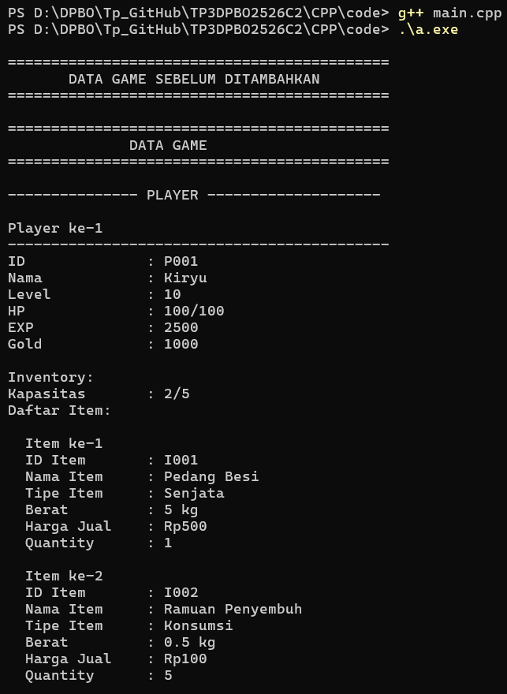

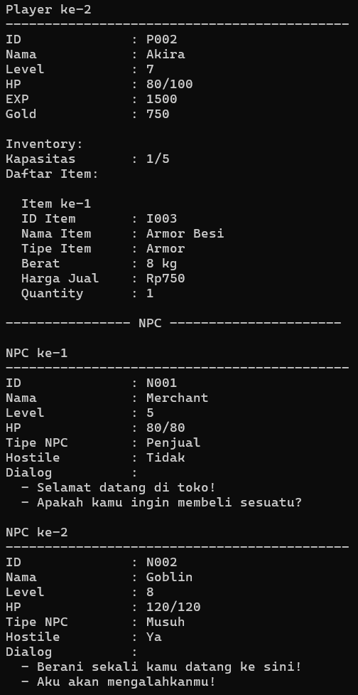

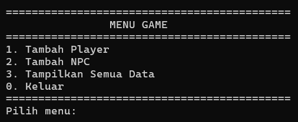

### Tambah Player


### Tambah NPC


### Hasil Setelah Tambah Data

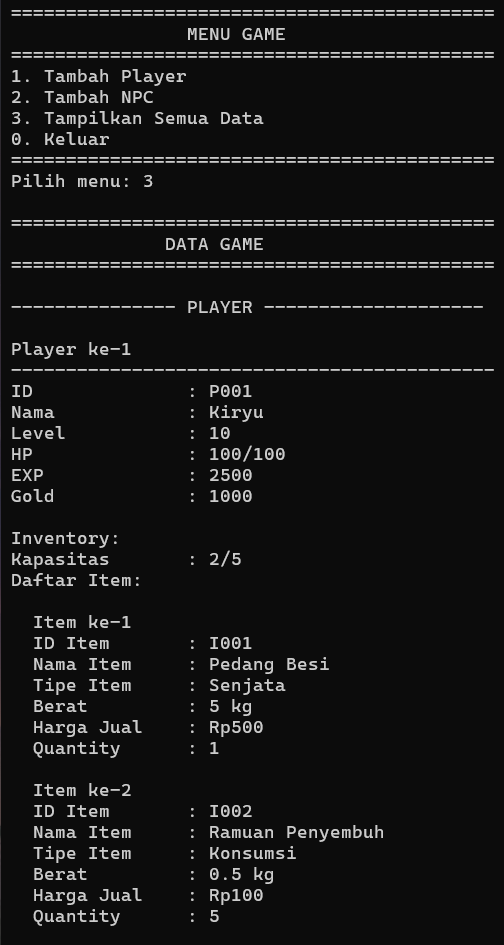


### Pengujian Error Handling

1. **Testcase 3 - ID karakter duplikat**

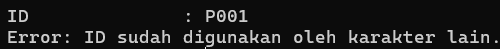

2. **Testcase 4 - Input kosong**


3. **Testcase 5 - Level negatif**


4. **Testcase 6 - Max HP tidak valid**

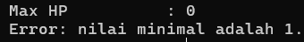

5. **Testcase 7 - HP melebihi Max HP**


6. **Testcase 8 - EXP negatif**


7. **Testcase 9 - Gold negatif**


8. **Testcase 10 - Kapasitas Inventory tidak valid**


9. **Testcase 11 - Jumlah Item melebihi kapasitas**

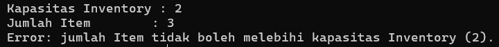

10. **Testcase 12 - Berat Item negatif**

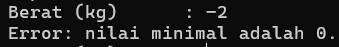

11. **Testcase 13 - Harga Item negatif**


12. **Testcase 14 - Quantity negatif**


13. **Testcase 15 - Input angka bukan angka**


14. **Testcase 16 - Status Hostile tidak valid**


---

## Python

### Tampilan Awal

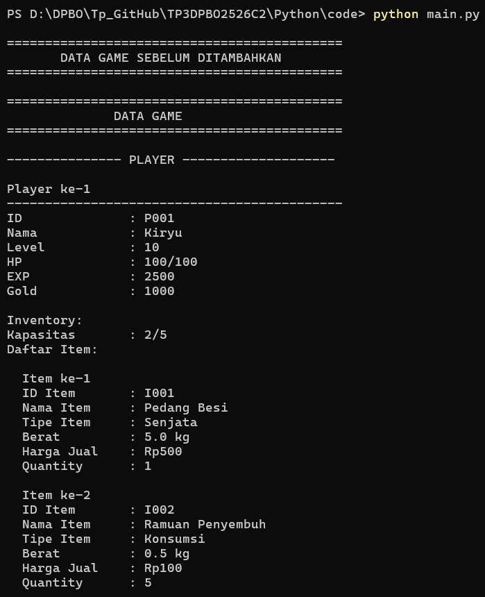

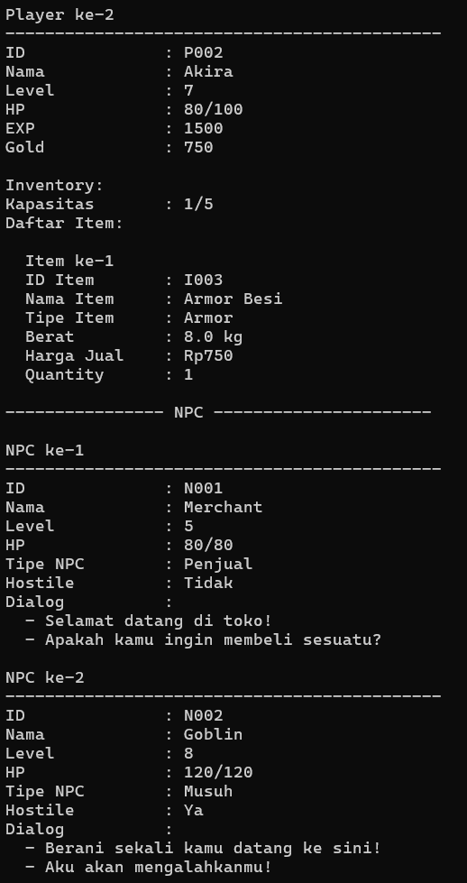


### Tambah Player


### Tambah NPC


### Hasil Setelah Tambah Data


### Pengujian Error Handling

1. **Testcase 3 - ID karakter duplikat**


2. **Testcase 4 - Input kosong**


3. **Testcase 5 - Level negatif**

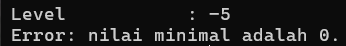

4. **Testcase 6 - Max HP tidak valid**


5. **Testcase 7 - HP melebihi Max HP**


6. **Testcase 8 - EXP negatif**

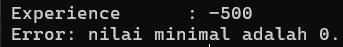

7. **Testcase 9 - Gold negatif**

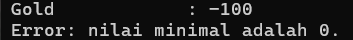

8. **Testcase 10 - Kapasitas Inventory tidak valid**

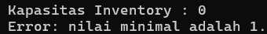

9. **Testcase 11 - Jumlah Item melebihi kapasitas**


10. **Testcase 12 - Berat Item negatif**


11. **Testcase 13 - Harga Item negatif**

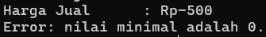

12. **Testcase 14 - Quantity negatif**

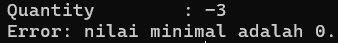

13. **Testcase 15 - Input angka bukan angka**


14. **Testcase 16 - Status Hostile tidak valid**

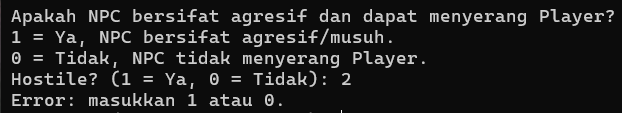

---

## Java

### Tampilan Awal

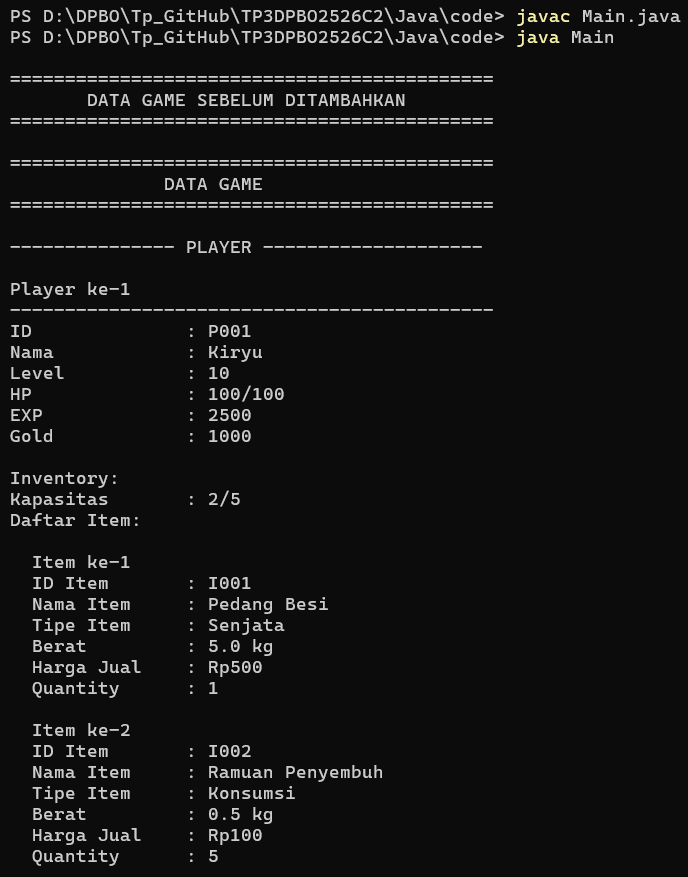


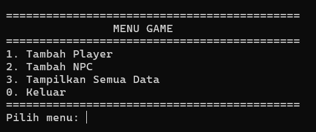

### Tambah Player

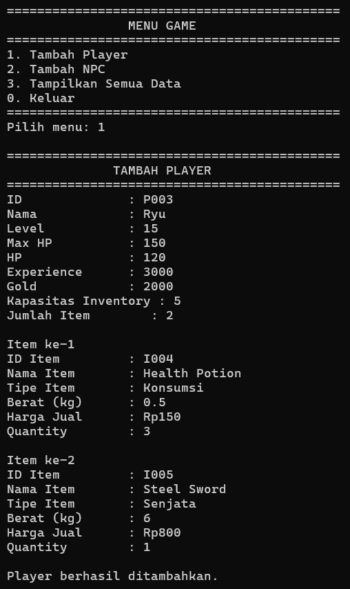

### Tambah NPC

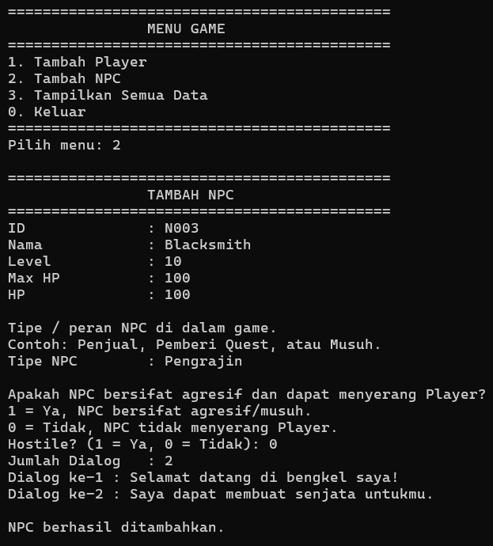

### Hasil Setelah Tambah Data


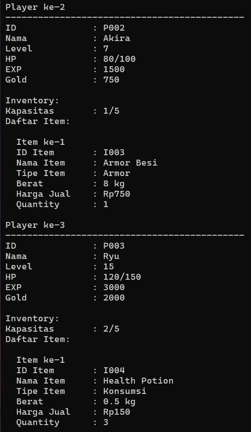

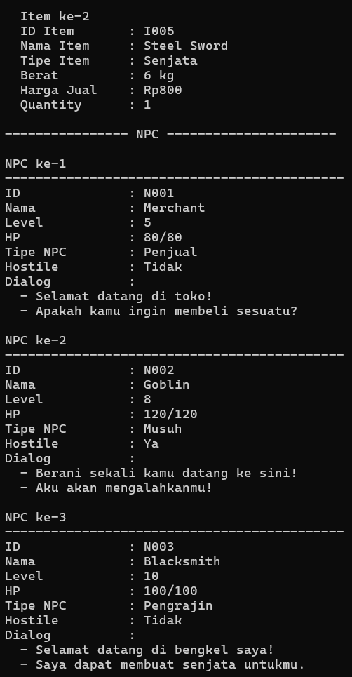

### Pengujian Error Handling

1. **Testcase 3 - ID karakter duplikat**


2. **Testcase 4 - Input kosong**

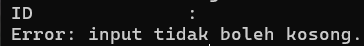

3. **Testcase 5 - Level negatif**


4. **Testcase 6 - Max HP tidak valid**


5. **Testcase 7 - HP melebihi Max HP**

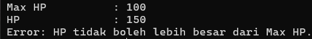

6. **Testcase 8 - EXP negatif**


7. **Testcase 9 - Gold negatif**


8. **Testcase 10 - Kapasitas Inventory tidak valid**


9. **Testcase 11 - Jumlah Item melebihi kapasitas**


10. **Testcase 12 - Berat Item negatif**


11. **Testcase 13 - Harga Item negatif**


12. **Testcase 14 - Quantity negatif**


13. **Testcase 15 - Input angka bukan angka**

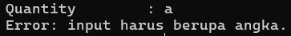

14. **Testcase 16 - Status Hostile tidak valid**


---

# Cara Menjalankan Program

## C++

Buka folder `CPP`, kemudian compile program menggunakan compiler C++.

Contoh:

```bash
g++ main.cpp -o main
```

Kemudian jalankan:

```bash
./main
```

Pada Windows:

```bash
main.exe
```

---

## Python

Buka folder `Python`, kemudian jalankan:

```bash
python main.py
```

---

## Java

Buka folder `Java`, kemudian compile:

```bash
javac Main.java
```

Kemudian jalankan:

```bash
java Main
```

---

# Struktur Repository

```text
TP3DPBO2526C2/
├── Desain_TP3.png
├── CPP/
│   ├── code/
│   │   ├── Inventory.cpp
│   │   ├── Item.cpp
│   │   ├── Karakter.cpp
│   │   ├── main.cpp
│   │   ├── NPC.cpp
│   │   ├── Player.cpp
│   │   └── testcase.txt
│   └── dokumentasi/
│       └── CPP_*.png (22 screenshot)
├── Java/
│   ├── code/
│   │   ├── Inventory.java
│   │   ├── Item.java
│   │   ├── Karakter.java
│   │   ├── Main.java
│   │   ├── NPC.java
│   │   ├── Player.java
│   │   └── testcase.txt
│   └── dokumentasi/
│       └── Java_*.png (22 screenshot)
├── Python/
│   ├── code/
│   │   ├── Inventory.py
│   │   ├── Item.py
│   │   ├── Karakter.py
│   │   ├── main.py
│   │   ├── NPC.py
│   │   ├── Player.py
│   │   └── testcase.txt
│   └── dokumentasi/
│       └── Python_*.png (22 screenshot)
└── README.md
```

---

# Kesimpulan

Program TP3 merupakan program sederhana bertema game yang menerapkan beberapa konsep pemrograman berorientasi objek.

Konsep inheritance digunakan melalui hubungan:

```text
             Karakter
             /      \
         Player      NPC
```

Hubungan tersebut merupakan **Hierarchical Inheritance** karena satu parent class memiliki dua child class.

Program juga menerapkan **Composition** melalui hubungan:

```text
Player
   ◆
Inventory
   ◆
Item
```

Selain itu, program menggunakan struktur data untuk menyimpan object, menerapkan method overriding melalui `tampilkan_info()`, serta menggunakan encapsulation untuk mengatur akses terhadap attribute.

Program dibuat dalam tiga bahasa, yaitu C++, Python, dan Java. Masing-masing versi dapat menampilkan object awal, menerima data tambahan dari user, melakukan validasi input, serta menampilkan seluruh data yang telah dimasukkan.

Dengan desain tersebut, program tidak hanya memenuhi implementasi inheritance, tetapi juga menunjukkan penggunaan beberapa konsep OOP yang saling berhubungan dalam sebuah program.
